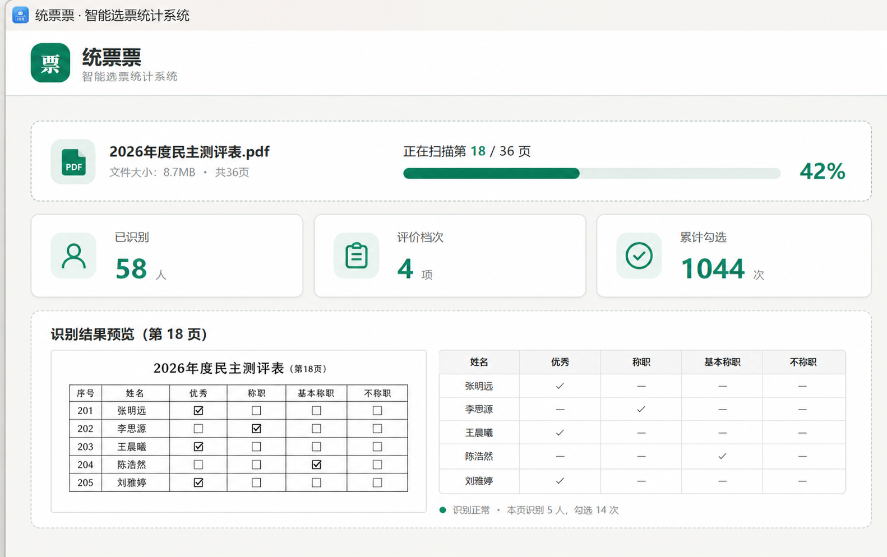
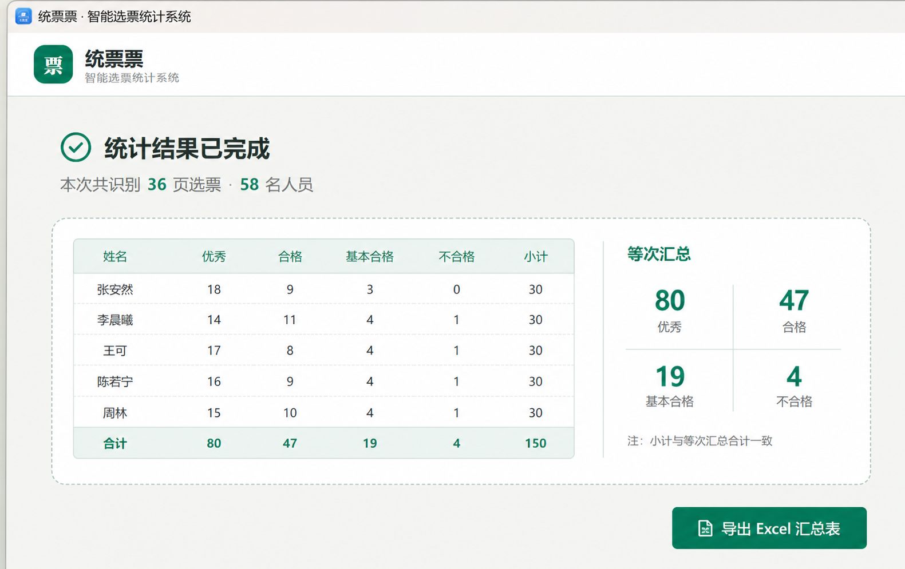
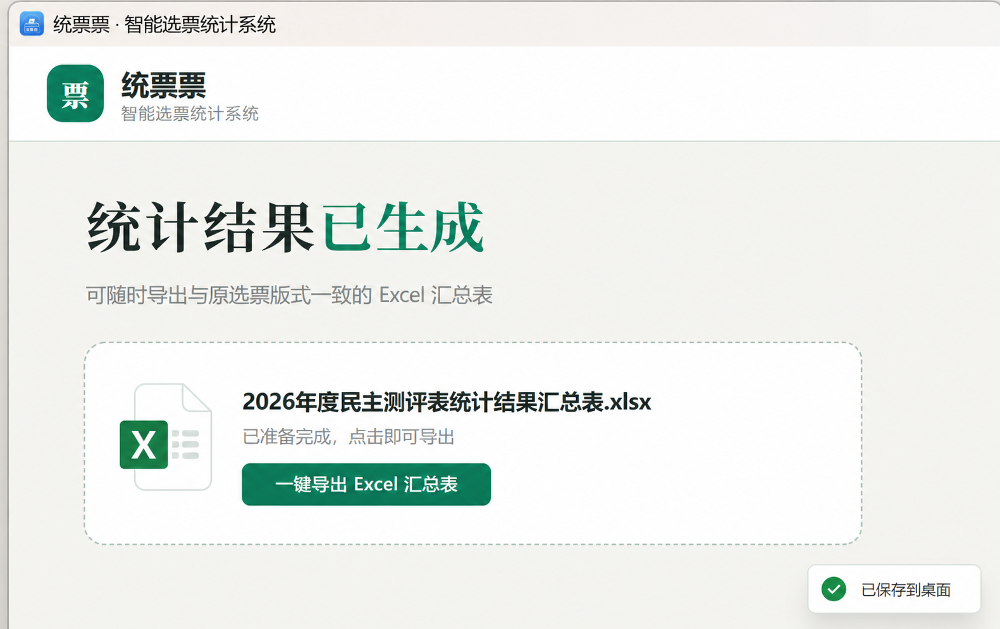
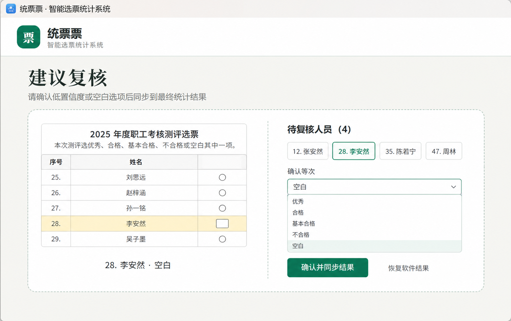

<p align="center">
  
</p>

<h1 align="center">统票票</h1>

<p align="center"><strong>完全断网运行的智能选票识别与统计系统</strong></p>

<p align="center">
  
  
  
  
</p>

> 从一张选票，到一份清晰、可复核、可直接归档的统计结果。

“统票票·智能选票统计系统”面向民主测评、年度考核、评优评先等纸质选票统计场景。软件自动分析 PDF 扫描件中的表格结构、人员姓名和评价档次，识别手写“√”，实时累计票数，并生成与原选票版式相匹配的 Excel 汇总表。

全部识别与统计均在本机完成，不上传选票、不调用云端 OCR，也不需要联网。

<p align="center">
  
</p>

## 下载与安装

前往 [Releases](../../releases/latest) 下载最新版 Windows 安装程序：

`TongPiaoPiao-v1.1.3-Windows-x64-Setup.exe`

支持 Windows 10 / 11 x64。安装包未使用商业代码签名证书，Windows 首次运行时可能显示“未知发布者”；请核对文件来源与 Release 中的 SHA-256 后再继续安装。

## 主要功能

| 功能 | 说明 |
| --- | --- |
| 自动识别选票结构 | 从 PDF 自动识别题头、人员序号、姓名、评价档次以及单栏或双栏布局 |
| 多页姓名校准 | 综合前 10 页同一序号的姓名格，优先采用最完整、最可信的识别结果 |
| 手写勾选识别 | 针对选框中的手写“√”进行本地识别和逐页累计 |
| 复杂痕迹判断 | 同格存在涂抹与“√”时优先识别勾选；同一人员出现多个“√”时采用最靠左结果 |
| 实时累计统计 | 识别过程中按“姓名 × 评价档次”实时更新票数矩阵 |
| 建议复核窗口 | 自动汇集低置信度和空白项目，按人员定位原票对应行并高亮显示 |
| 人工修正同步 | 支持下拉框、鼠标滚轮、逐项确认及空白项批量确认，修改立即同步到统计结果 |
| 原版式 Excel | 汇总表参考原选票的单栏、双栏及表格结构生成，不强制套用固定模板 |
| 大文件支持 | 单个 PDF 最大支持 100MB，采用分批渲染策略处理多页扫描件 |
| 完全离线 | OCR、复核、统计与导出均在本机执行，不上传原始文件 |

## 使用流程

1. 点击“选择 PDF”，上传已经人工筛选过的扫描版选票。
2. 软件自动分析选票题头、人员名单、评价档次和页面布局。
3. 等待逐页扫描与累计；必要时打开“建议复核”窗口进行人工确认。
4. 点击“导出 Excel 汇总表”，保存最终统计结果。

## 界面预览

<p align="center">
  
</p>

<p align="center"><strong>识别工作台：进度、结构识别和累计结果集中呈现</strong></p>

<p align="center">
  
</p>

<p align="center"><strong>汇总结果：按人员和评价档次实时累计</strong></p>

<p align="center">
  
</p>

<p align="center"><strong>手动导出：确认后再生成 Excel 汇总表</strong></p>

<p align="center">
  
</p>

<p align="center"><strong>人工复核：定位原票、修改等次并立即同步统计</strong></p>

## 识别建议

- 推荐使用 300 DPI 左右、方向端正、表格边线完整的扫描件。
- 同一份 PDF 应使用相同或高度相似的选票模板。
- 软件会将低置信度及未勾选项目列入建议复核；正式归档前建议完成一次人工核对。
- 上传文档应当已经完成人工废票筛选，软件直接统计，不重复判定废票。

## 隐私与数据安全

- 不连接云端 OCR，不上传 PDF、姓名或统计结果。
- 不包含用户登录、广告、遥测或后台数据收集功能。
- OCR 临时页和任务数据仅保存在本机应用数据目录。
- Excel 仅在用户点击导出后生成。

更多信息请阅读 [隐私说明](PRIVACY.md)。

## 本地开发

环境要求：Node.js 20+、pnpm、Electron 37，以及 Windows 版 Poppler 运行库。

```powershell
npm test
cd desktop
pnpm install
pnpm run dist
```

为控制仓库体积和第三方二进制许可，本仓库不提交 `desktop/resources/poppler/Library`。封装前请将合法取得的 Poppler Windows 运行库放入该目录；普通用户直接使用 Release 安装包即可，安装包已经包含离线运行所需组件。

## 项目结构

```text
public/                  主界面与复核界面
scripts/                 本地 OCR 与 Excel 导出模块
server.mjs               本地任务服务
desktop/                 Electron 桌面封装工程
tests/                   自动化回归测试
docs/images/             仓库展示图片
```

## 版本记录

查看 [CHANGELOG.md](CHANGELOG.md)。

## 许可

当前仓库未附开源许可证。除 GitHub 平台展示与下载所必需的权利外，其他权利均予保留；如需二次分发、商业使用或基于源码制作衍生版本，请先取得版权所有者明确授权。

<p align="center">Copyright © 2026 统票票. All rights reserved.</p>
